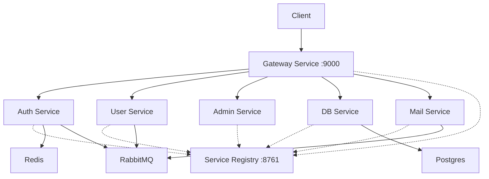

# OrgV Backend (Type 2)

This project is a microservices-based backend system built using Java and Spring Boot. It leverages Spring Cloud for service discovery and API gateway capabilities.
In type 2 everything in db is encrypted like username, email, etc. Rest is same as type 1

## Architecture

The system consists of several microservices communicating with each other and external infrastructure components.



## Services Overview

| Service | Port | Description |
| :--- | :--- | :--- |
| **Service Registry** | `8761` | Netflix Eureka Server for service discovery. |
| **Gateway Service** | `9000` | Spring Cloud Gateway acting as the entry point. |
| **Auth Service** | Random | Handles authentication, OAuth2 (Google, GitHub), and security tokens. |
| **User Service** | Random | Manages user data and profiles. |
| **Admin Service** | Random | Administrative operations. |
| **DB Service** | Random | Database interaction layer (PostgreSQL). |
| **Mail Service** | Random | Sends email notifications via SMTP. |
| **Commons** | N/A | Shared library containing common DTOs, utilities, and configurations. |

## Prerequisites

*   **Java**: JDK 25 (Configured in `pom.xml`)
*   **Maven**: Apache Maven
*   **Infrastructure**:
    *   PostgreSQL
    *   Redis
    *   RabbitMQ
    *   Unleash (Feature Flags)
    *   SMTP Server (e.g., Gmail)

## Environment Variables

The following environment variables must be set for the services to run correctly. You can set them in your IDE run configuration or a `.env` file if using Docker.

| Variable | Description | Required By |
| :--- | :--- | :--- |
| `AES_RANDOM_SECRET_KEY` | Secret key for AES encryption | All Shared Services |
| `AES_STATIC_SECRET_KEY` | Static key for AES encryption | All Shared Services |
| `INTERNAL_TOKEN_ENCRYPTION_SECRET_KEY` | Key for internal token encryption | All Shared Services |
| `UNLEASH_URL` | Boolean/Feature flag service URL | Gateway, Admin, Auth, User |
| `UNLEASH_API_TOKEN` | Token for Unleash | Gateway, Admin, Auth, User |
| `DB_URL` | JDBC URL (e.g., `jdbc:postgresql://localhost:5432/mydb`) | DB Service |
| `DB_USER` | Database username | DB Service |
| `DB_PASSWORD` | Database password | DB Service |
| `REDIS_HOST` | Redis Host | Auth, User |
| `REDIS_PASSWORD` | Redis Password | Auth, User |
| `RABBITMQ_HOST` | RabbitMQ Host | Auth, User, Mail |
| `RABBITMQ_USERNAME` | RabbitMQ Username | Auth, User, Mail |
| `RABBITMQ_PASSWORD` | RabbitMQ Password | Auth, User, Mail |
| `MAIL_USERNAME` | SMTP Username | Mail Service |
| `MAIL_PASSWORD` | SMTP Password | Mail Service |
| `GOOGLE_CLIENT_ID` | OAuth2 Client ID for Google | Auth Service |
| `GOOGLE_CLIENT_SECRET` | OAuth2 Client Secret for Google | Auth Service |
| `GITHUB_CLIENT_ID` | OAuth2 Client ID for GitHub | Auth Service |
| `GITHUB_CLIENT_SECRET` | OAuth2 Client Secret for GitHub | Auth Service |
| `GOD_USER_*` | Username/Password/Email for God User | DB Service |
| `GLOBAL_ADMIN_USER_*` | Username/Password/Email for Global Admin | DB Service |

## Installation & Build

1.  **Build Shared Library**:
    The `commons` module is a dependency for other services. It must be built first.
    ```bash
    cd commons
    ./mvnw clean install
    ```

2.  **Build Services**:
    Build each service individually using Maven.
    ```bash
    cd <service-name>
    ./mvnw clean install
    ```

## Running the Application

It is recommended to start the services in the following order:

1.  **Infrastructure Requirements**: Ensure Redis, RabbitMQ, and PostgreSQL are up and running.
2.  **Service Registry**: Start `service-registry`. 
    *   Access Dashboard: `http://localhost:8761`
3.  **Gateway Service**: Start `gateway-service`.
4.  **Dependent Services**: Start `db-service`, `auth-service`, `user-service`, etc.

### Running with Maven
```bash
cd service-registry
./mvnw spring-boot:run
```

## Development

*   **Lombok**: Ensure your IDE has the Lombok plugin installed as it is used extensively.
*   **Java Version**: The project is configured for **Java 25**. Ensure your local environment matches or update the `pom.xml` properties if you are using a different version (downgrading might require code changes if recent features are used).
*   **Spring Cloud**: Version `2025.1.0`.
